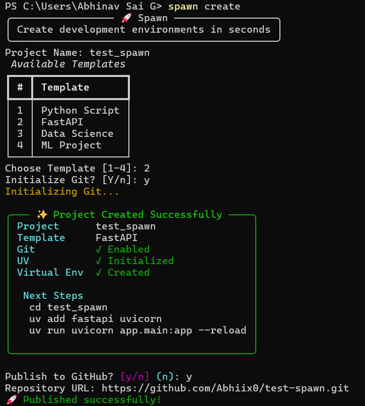

<div align="center">

# Spawn

> One command. Full project. Ready to build.

[](https://python.org)
[]()
[](LICENSE)
[](https://github.com/astral-sh/uv)



</div>

---

You know the drill — `mkdir`, `cd`, `git init`, `python -m venv`, `source .venv/activate`...
before you've written a single line of real code.

**Spawn replaces all of that with:**

```bash
spawn create
```

Pick a template, answer two prompts, and you're in a fully structured project with Git and a virtual environment already set up.

---

## Get Started

**Prerequisites:** Python 3.12+, [uv](https://github.com/astral-sh/uv), Git

```bash
git clone https://github.com/Abhiix0/Spawn.git
cd Spawn
uv sync
uv tool install .
```

Then just run `spawn create` — it'll show you what to do next.

---

## What's Inside

4 project templates. An interactive prompt. Smart next-step hints after every setup.

There's also a roadmap with some things in the works — GitHub integration, Docker support, a template marketplace. Check the repo if you're curious or want to contribute.

---

<div align="center">

**[⭐ Star on GitHub](https://github.com/Abhiix0/Spawn)** · **[🐛 Report a Bug](https://github.com/Abhiix0/Spawn/issues)** · **[💡 Request a Feature](https://github.com/Abhiix0/Spawn/issues)**

</div>
